# Architecture

Mercury is a backend-focused personal knowledge engine. The backend accepts documents, processes them asynchronously, stores chunks and embeddings, and exposes RAG, quiz, flashcard, snippet, and WhatsApp review workflows.

For design tradeoffs, see the [Architecture Decision Records](adr/README.md).

## System Overview

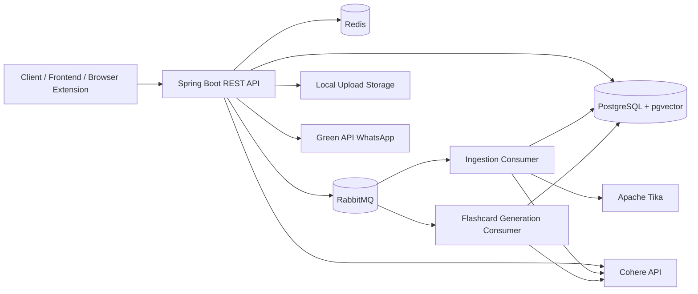

## Document Upload and Ingestion

Document upload is intentionally split from document processing. The HTTP request stores the document and records an outbox event; ingestion happens asynchronously through RabbitMQ.

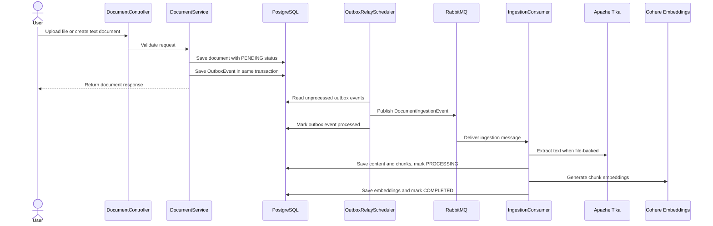

## Document Status Lifecycle

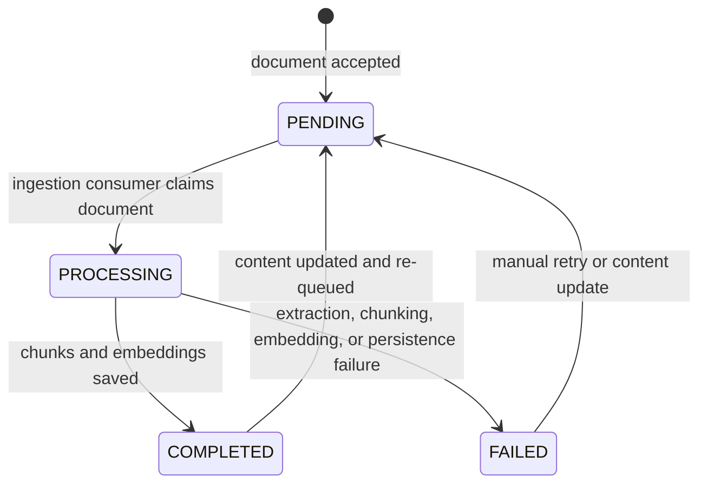

## RabbitMQ Topology

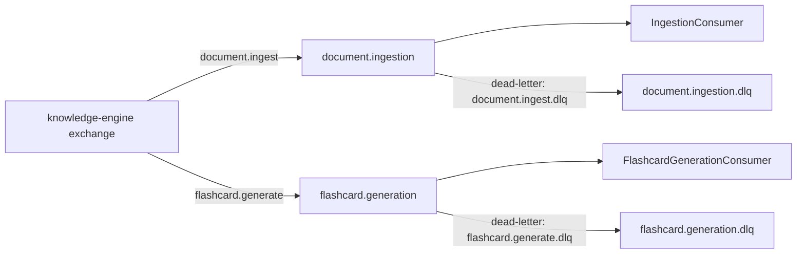

Both primary queues are durable and configured with dead-letter routing. This keeps failed or expired messages inspectable instead of silently dropping them.

## RAG Query Flow

RAG requests first run semantic search, then use the retrieved chunks as context for grounded answer generation.

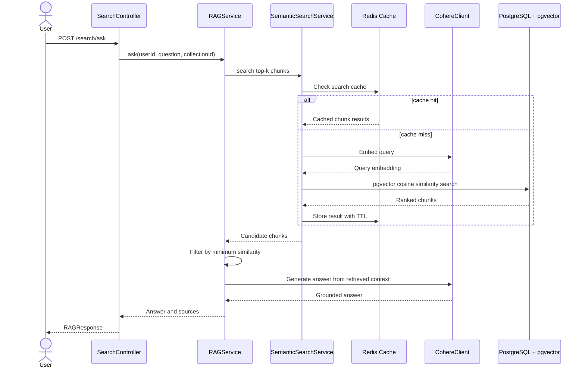

## Streaming RAG Flow

The streaming endpoint uses the same retrieval path, then emits sources first and answer tokens as they arrive.

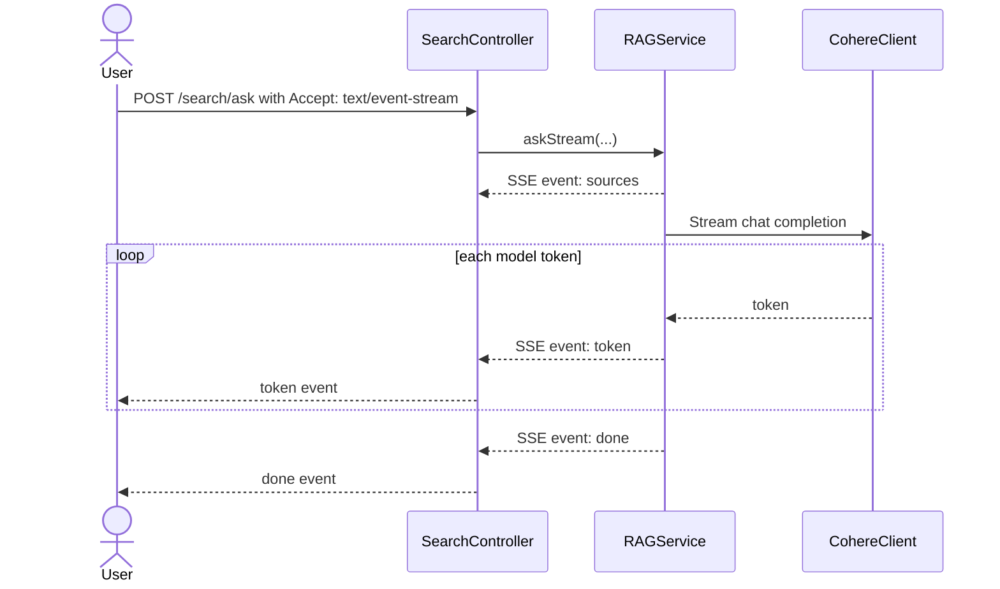

## Quiz and Flashcard Flow

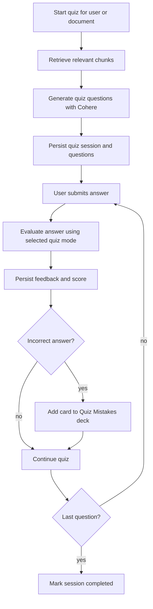

Flashcards use SM-2 scheduling. Review quality updates ease factor, interval, and next review date.

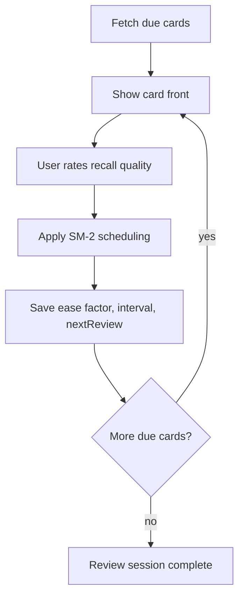

## WhatsApp Review Flow

WhatsApp review is built on top of the flashcard scheduling model. Redis stores short-lived session state while the user answers cards through WhatsApp.

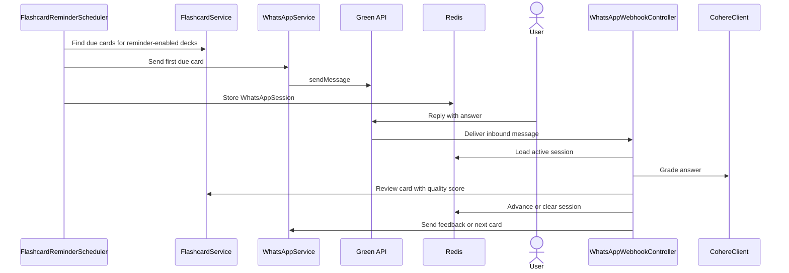

## Failure Handling and Observability

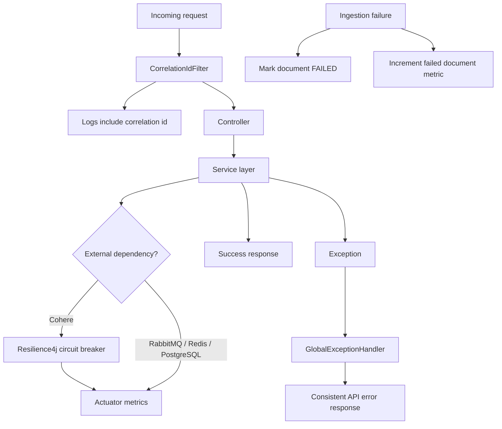

Operational surfaces:

- `/actuator/health` for service health.
- `/actuator/metrics` for counters and dependency metrics.
- `X-Correlation-Id` for request tracing through logs.
- RabbitMQ management UI for queue and DLQ inspection.
- GitHub Actions backend CI for regression checks.

## Data Ownership

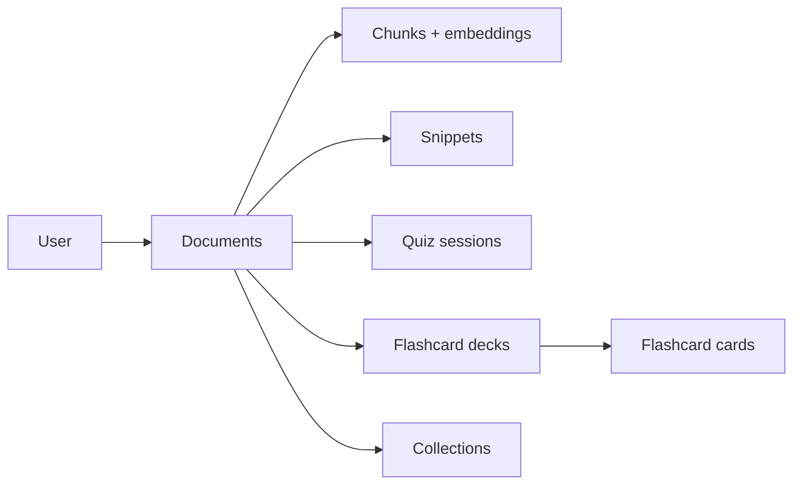

Most user-facing features are scoped by `userId`, and collections provide an additional document grouping boundary for search and organization.
